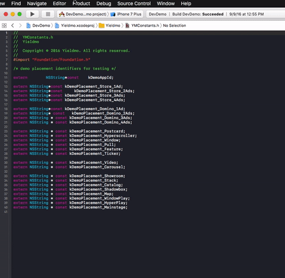

# uncrustifier
A simple Xcode 12 extension that wraps https://github.com/uncrustify/uncrustify/

## build
1. Build using Xcode 12+.
1. If you are using macOS 10.11, run ```sudo /usr/libexec/xpccachectl``` and restart your machine.
1. Replace /Uncrustify/uncrustify.cfg with your desired configuration file.
1. Open Uncrustifier.xcodeproj and run the Uncrustify target.  Choose Xcode as the host application.
2. Make sure a valid team is set in both `Uncrustifier` and `Uncrustify` target: Project > Targets > (Signing section) Team

### installation
1. To install the extension, grab the latest [release](https://github.com/yieldmo/uncrustifier/releases).  When you open Uncrustifier.app, the extension will be added to XCode.
2. You can change the configuration file without rebuilding by overwriting ```Uncrustifier.app/Contents/PlugIns/Uncrustify.appex/Contents/Resources/uncrustify.cfg```

## usage

Xcode > Editor > Uncrustify > Format Current Document

Hint: this works only for Objective-C files.



The extension will format the active file.

## contributing

Feel free to send bugs or feature requests [here](https://github.com/yieldmo/uncrustifier/issues).

[Pull requests](https://github.com/yieldmo/uncrustifier/pulls) are also welcome!
